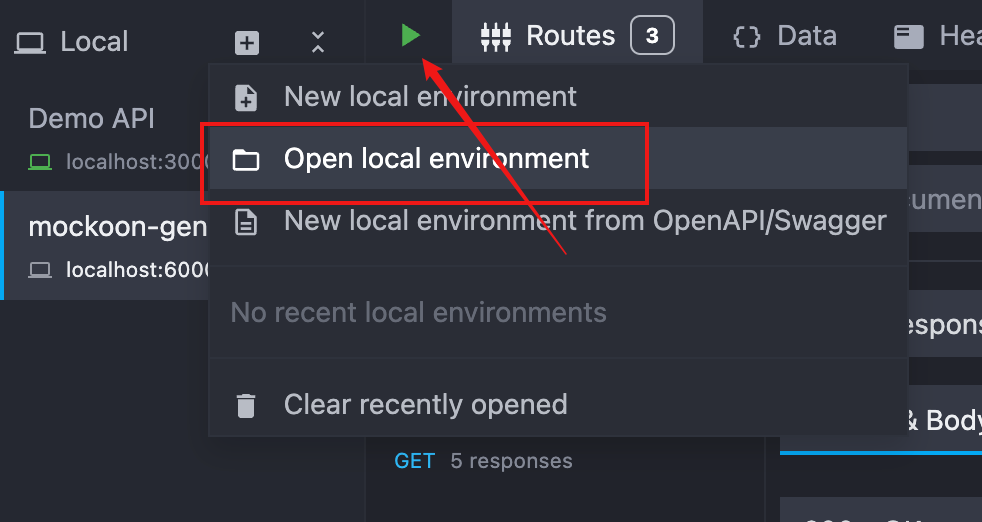
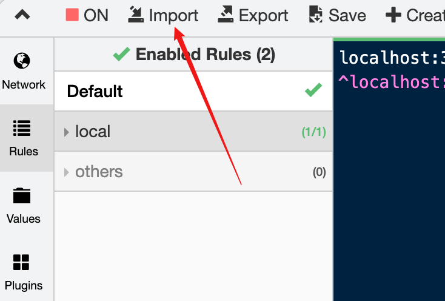

# 零侵入接口 Mock：mockoon-gen skill

## 背景

前端开发有一个常见的场景：后端接口尚未就绪或联调环境不稳定，但页面已经需要继续开发和验证，这时就需要对接口进行数据 mock。
常见的方案有：
1. mock 数据写死在代码里。这种方案最快，但是对代码侵入性较强，对 git 记录有影响，需要注意清理。
2. 使用工具启动本地服务器。如 postman、mockoon 等。但 postman 等需要将 url 换成它提供前缀，还是要对代码有一定的修改，推荐使用 mockoon。
3. 使用 MSW。在浏览器中启动 worker 拦截请求，返回本地配置数据，这也是 AI 说的比较主流的方案。

我面临的具体场景是一个微前端项目：  
团队只负责其中一个子路由，但启动配置在根目录，属于公共部分，影响范围较广。如果想使用 MSW，要么在启动配置加一些参数，要么在子路由公共配置加一些条件判断，不仅影响面较广，还需要说服团队 review 通过。  
因此，希望可以零侵入地解决数据 mock 的问题，自己爽用就行。所以选择使用 mockoon，考虑到适用性，使用 whistle 进行转发，防止跨域问题，考虑到便用性，决定蒸馏一个可以自动生成 mock 配置的 skill。

## why mockoon-gen skill
`mockoon-gen` 能够根据接口文档和项目配置生成 whistle 规则和 mockoon 数据配置文件，用户将文件导入 whistle 和 mockoon 就能实现对应接口的数据 mock。默认生成成功、空数据、错误、列表、随机空数据（可选）等响应场景。
主要流程
```text
  一般的接口文档（每个团队可能都不太一样）
        │
        ▼
  标准 OpenAPI 文档
        │
        ▼
mock-artifact.json（场景、审查项、语义映射、输出配置）
        │                          │
        ├──► mockoon.json          └──► whistle.json / whistle.cjs
        │       Mockoon GUI / CLI                 Whistle
        ▼
本地 HTTP Mock 服务  ◄──────────── 浏览器或客户端请求代理
```

生成以下产物：

| 产物 | 用途 |
| --- | --- |
| `openapi.yaml` | 普通接口文档规范化后的接口契约。 |
| `mock-artifact.json` | 记录契约 review 状态、响应场景、语义映射和输出配置的审查中间产物。 |
| `mockoon.json` | 可由 Mockoon Desktop 打开或由 Mockoon CLI 启动的本地 HTTP Mock 服务。 |
| `whistle.json` 或 `whistle.cjs` | 将指定 API host 的请求转发到本地 Mockoon 的 Whistle 规则。 |

## 安装与触发
GitHub：https://github.com/yzin-17/skills

安装单个 skill：

```bash
npx skills@latest add yzin-17/skills -s mockoon-gen
```

使用类似下面的任务触发即可：

```text
$mockoon-gen 根据接口文档生成 mock 配置。
```

## 使用流程：你需要做的决策

使用者应在下列节点给出业务判断。

### 1. 从普通接口文档生成 OpenAPI，并完成 review

如果输入不是 OpenAPI，会先尝试转换接口生成 `openapi.yaml`。随后由用户确认。

这一步不能跳过：普通文档可能存在字段含义不清、状态码遗漏或前后端约定不一致。生成器能把文档转换成结构化契约，但不能替代接口 review。

### 2. 选择响应场景

每个接口默认包含：

- `success-default`：符合 schema 的常规成功响应；
- `success-empty`：空值或空结构的成功响应，用于验证空态 UI；
- `error-default`：HTTP 500，响应为 `{"code":"MOCK_ERROR"}`；
- `success-list-N`：响应中识别到列表且启用列表策略时生成。

当 skill 询问是否开启“随机空值”模式时，应按测试目标决定：

- **常规联调：关闭。** 使用符合契约的默认、空数据和错误场景即可。
- **健壮性验证：开启。** 会增加 `success-random-empty`，任意字段都可能出现 `null`、空字符串、空数组或空对象，甚至违背 `required` 或非 `nullable` 约束。它用于发现前端的防御性渲染问题，不代表后端合法响应。

### 3. 确认字符串字段的语义

skill 会遵守 OpenAPI 中已有的 `format`。对没有 `format` 的字符串字段，需要判断其语义是否明确：`email`、`avatarUrl`、`productName` 等字段可以映射到 Faker 的对应数据生成器；字段含义模糊时，应保留通用字符串样例并记录 review 问题，而不是猜测。

例如商品名可声明为：

```json
{
  "path": "items[].productName",
  "faker": "commerce.productName"
}
```

### 4. 决定运行方式与代理范围

无论是否使用 Whistle，都要选择一个未占用的 Mockoon 端口，例如 `3100`。

若页面可以安全地切换到 localhost，只导出并启动 Mockoon 即可。若必须保持原始 API 域名，则还要提供：

- Whistle 规则组名称，方便启停；
- 每个接口对应的原始 API host，例如 `api.example.test`（skill 会尝试从项目配置中读取）；
- Whistle 导出格式：`json` 或 `cjs`。

格式必须显式选择：whistle 的 GUI 和 CLI 配置文件格式不一致，需要根据使用习惯选择导出格式。

## 如何使用生成的配置

生成完成后，按你的运行方式使用产物即可。

### GUI
#### Mockoon
导入配置再启动服务器即可


官方教程[[1]](https://mockoon.com/docs/latest/about/)

#### Whistle
打开面板导入即可


官方教程[[2]](https://wproxy.org/docs/)

### CLI
#### Mockoon

```bash
mockoon-cli start --data ./path/to/mockoon.json
```
#### Whistle
```bash
w2 add ./path/to/whistle.cjs
```

## 常见问题

### 导出提示 OpenAPI 未确认或哈希不匹配

前者表示接口契约尚未完成 review；后者表示 `openapi.yaml` 已更新，而 artifact 仍对应旧版本。两种情况都应回到 OpenAPI，确认变更后重新生成。

### 启动了 Mockoon，页面仍访问真实后端

检查是否需要 Whistle。如果需要，按“Mockoon 是否启动 → Whistle 规则组是否启用 → 浏览器流量是否经过 Whistle → host/路径是否匹配”的顺序排查。

### 只能导出 Mockoon，不能导出 Whistle

确认是否已提供规则组名称、每个接口的 API host，以及明确的 `json` / `cjs` 导出格式。

## 适用边界

`mockoon-gen` 适合“已有接口文档、需要独立 HTTP Mock、希望将配置纳入 review 与 Git 管理”的联调场景。它不替代：

- 每个测试用例按运行时条件覆盖响应的测试 mock；这类需求更适合 MSW 或测试框架内 mock。
- 复杂鉴权状态、跨接口持久化状态或业务脚本的服务端仿真。
- 未达成共识的接口设计；生成器只能放大契约，不能完成设计决策。

它的核心价值是：把“普通接口文档 → 已 review 的 OpenAPI → 可运行 Mock 服务与代理规则”固化为一条可追溯流程，在不侵入前端业务工程的前提下完成联调。

## 参考文献

1. Mockoon, *Mockoon Documentation*, https://mockoon.com/docs/latest/about/，访问日期：2026-07-16。
2. Whistle, *Whistle Documentation*, https://wproxy.org/docs/，访问日期：2026-07-16。
